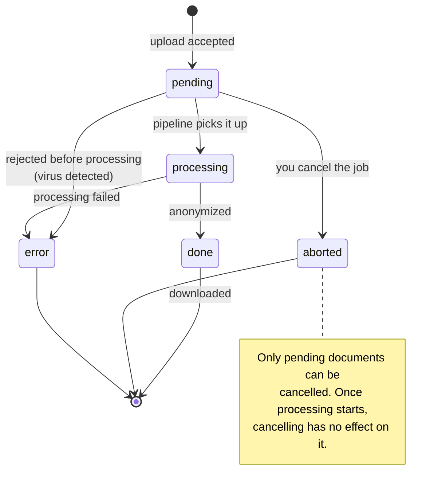
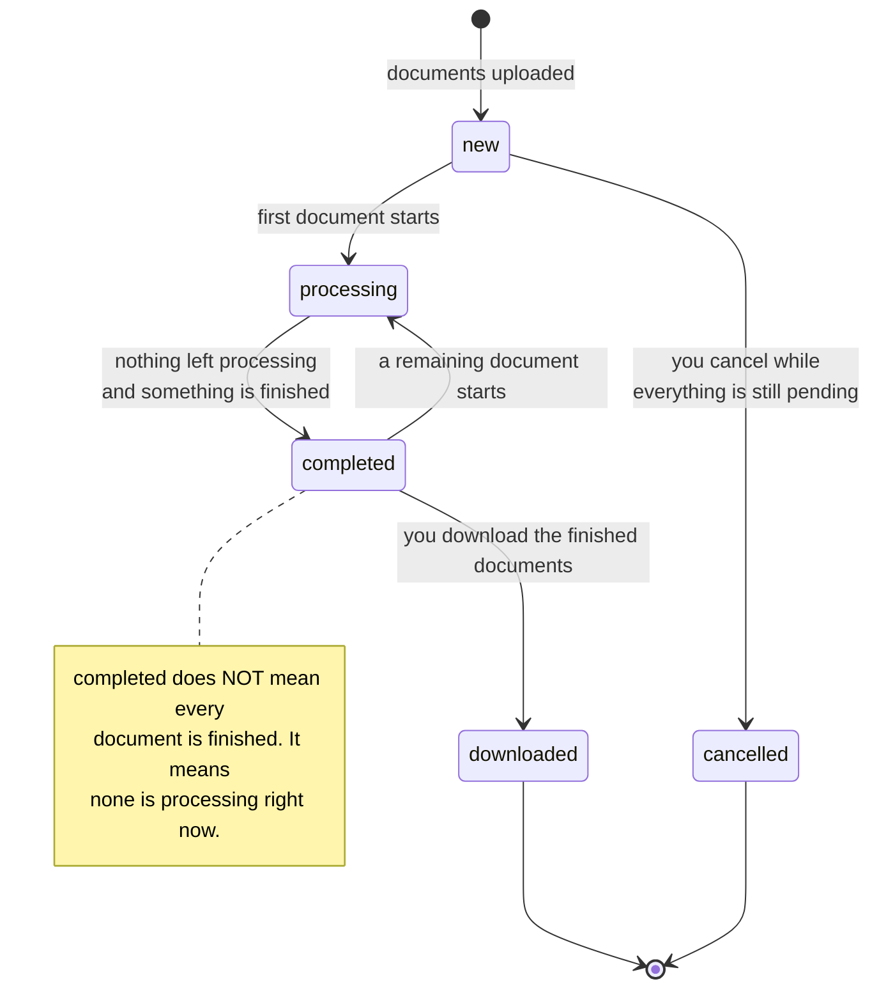
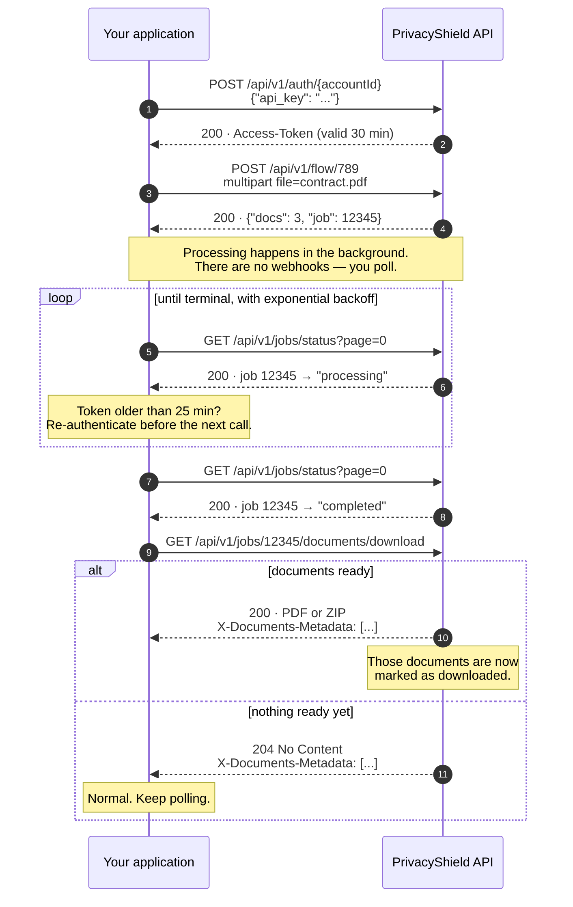

# Document and job lifecycle

Every submission creates one **job** containing one or more **documents**. Documents have their own state; the job's state is derived from them. Understanding both is what tells you when to stop polling and start downloading.

## Document states

| State | Meaning |
|---|---|
| `pending` | Received and queued. Nothing has happened to it yet |
| `processing` | Somewhere in the anonymization pipeline |
| `done` | Anonymized and available for download |
| `aborted` | Cancelled before processing started |
| `error` | Processing failed, or the file was rejected — an infected file lands here too |

`done`, `aborted` and `error` are terminal. A document never leaves them.

Terminal is not permanent, though: **a finished document is deleted automatically 5 days after it finishes**, and from then on the job returns `410 The job has been deleted`. Download and store your results well inside that window. See [limits.md](limits.md#retention).

You see document states in the `X-Documents-Metadata` header of both download endpoints — including on a `204` response, which is how you find out that a job produced nothing because every document errored. See [download-results.md](endpoints/download-results.md).

## Job states

A job's status is **computed from its documents on every query**, not stored. Two calls seconds apart can return different values.

| State | Derived from |
|---|---|
| `new` | Every document is pending |
| `processing` | At least one document is being processed |
| `completed` | At least one document has finished and none is currently processing |
| `downloaded` | Every finished document has been downloaded |
| `cancelled` | Every document is aborted |

### `completed` is not the same as "everything is done"

This trips up multi-document jobs. Suppose you upload a ZIP with three PDFs. Two finish, the third is still queued and has not started. Nothing is processing, and something has finished — so the job reports `completed`, with one document still `pending`.

If you download at that moment you get the two finished documents, and those two are marked as downloaded. The third stays in the job and you download it in a later call.

So `completed` is your signal to **download**, not your signal to **stop**. You are finished with a job when every document in `X-Documents-Metadata` is in a terminal state (`done`, `aborted` or `error`) and you have downloaded the ones you want.

### Jobs that fail completely disappear from the listing

`GET /api/v1/jobs/status` excludes deleted jobs and jobs that failed completely. A polling loop that waits for a job to show up in that listing will wait forever if the job failed outright.

Bound your loop by attempts, not just by wall-clock time, and treat "my job is not in the listing any more" as a terminal outcome rather than a reason to keep polling. Both example clients raise an explicit error in that case instead of hanging.

## A typical integration

## Polling strategy

There are no webhooks. Polling is the only mechanism, so poll well.

**Use exponential backoff.** Start at about 2 seconds, double after each attempt, cap at 30 seconds. A job that takes ten minutes should not cost you three hundred requests.

**Set a global timeout.** Decide up front how long you are willing to wait — 15 minutes is a reasonable default — and fail with a clear message when you reach it. The job keeps processing on the server; you can pick it up later with the account-wide download.

**Refresh the token inside the loop.** A 20-minute wait started with a 25-minute-old token will fail halfway through. Check the token's age before every request. See [authentication.md](authentication.md#refresh-strategy).

**Treat `204` as normal.** On the download endpoint it means "nothing ready yet", not "something went wrong". Never log it as an error.

**Retry `5xx`, not `4xx`.** A `400` will fail identically forever. See [errors.md](errors.md).

### Which endpoint to poll

| Approach | How it works | Use it when |
|---|---|---|
| Poll `GET /api/v1/jobs/status` | Look up your job in the listing, wait for `completed`, then download once | Default. Clean separation between "is it ready" and "give it to me" |
| Poll `GET /api/v1/jobs/{jobId}/documents/download` | Call the download endpoint on a timer; `204` means keep waiting | You want each document as soon as it is ready and do not mind several partial downloads |

The status endpoint returns your jobs newest first, 40 per page, so a job you just created is on page 0. If your account creates jobs at a high rate from several processes, page through until you find it rather than assuming page 0.

Both example clients implement the first approach in `wait_for_job` / `waitForJob`:

- [`examples/python/05_end_to_end.py`](../examples/python/05_end_to_end.py)
- [`examples/java/src/main/java/com/privacyshield/examples/EndToEnd.java`](../examples/java/src/main/java/com/privacyshield/examples/EndToEnd.java)

## Cancelling

Cancelling affects only documents that have not started processing. Documents already in the pipeline finish normally, and finished documents are untouched. The response tells you exactly how many documents actually changed state, in `abortedDocuments` — that number can be `0`, which is not an error.

### Cancelling and your page quota

Pages are charged when a document starts processing:

| Document state when you cancel | Pages charged |
|---|---|
| `pending` — not started | **No.** The document is aborted and costs nothing |
| `processing` — already started | **Yes.** It finishes and its pages are charged in full |

This is what makes cancelling worth doing on a submission you sent by mistake: you stop paying for everything that has not started yet. Cancel as soon as you notice, because the pending set shrinks as the pipeline picks documents up.

See [cancel-jobs.md](endpoints/cancel-jobs.md).
